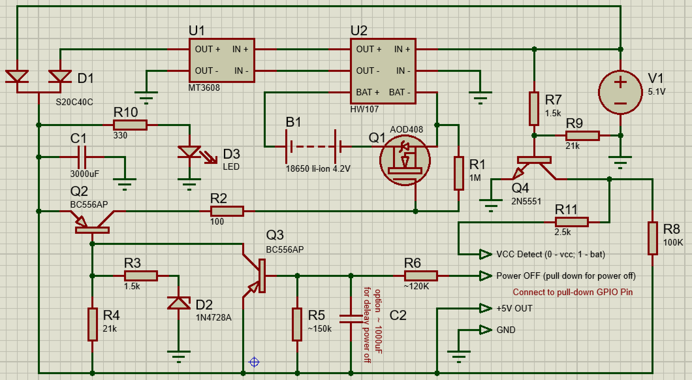

# UPS для ARM PC
## GPIO для odroid C1
- Для синганлизации потери сетевого питания `VCC Detect` используется GPIO IN: `GPIO 100 / GPIOX_3 / WiringPi 22 / Odroid Pin 31`
- Для выключения UPS `Power OFF` используется GPIO OUT with PULL-DOWN: `GPIO 108 / GPIOX_11 / WiringPi 23 / Odroid Pin 33`

## Установка пакетов
```Bash
sudo apt install software-properties-common
sudo add-apt-repository ppa:hardkernel/ppa
sudo apt update
sudo apt install odroid-wiringpi libwiringpi-dev libwiringpi2
```

## Настройка GPIO для выключения UPS
Для выключения UPS после завершения системы используем GPIO Led (GPIO with PULL-DOWN)
1. Переходим в `/media/boot`  
   `cd /media/boot/`
2. Редактируем meson8b_odroidc.dts:  
   `nano meson8b_odroidc.dts`
3. Вставляем в раздел leds блок с poweroff:
    ```cpp
    leds {
        compatible = "gpio-leds";
        /* Blue LED */
        hearbeat {
            label = "blue:heartbeat";
            gpios = "GPIOAO_13";
            default-state = "off";
            linux,default-trigger = "heartbeat";
        };
        poweroff {
            label = "poweroff";
            gpios = "GPIOX_11";
            default-state = "on";
            linux,default-trigger = "default-on";
        };
    };
    ```
4. Компилируем meson8b_odroidc.dtb  
   `dtc -I dts -O dtb meson8b_odroidc.dts > meson8b_odroidc.dtb`

## Компиляция и установка safe-shutdown
```Bash
gcc safe-shutdown.c -lwiringPi -lwiringPiDev -lm -lpthread -lrt -lcrypt
mv a.out /bin/safe-shutdown
cp safe-shutdown.service /etc/systemd/system/
systemctl enable safe-shutdown.service
systemctl start safe-shutdown.service
```

## Схема UPS

